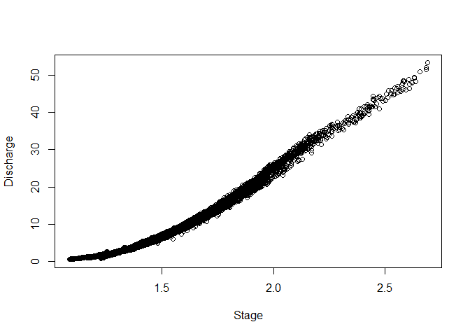
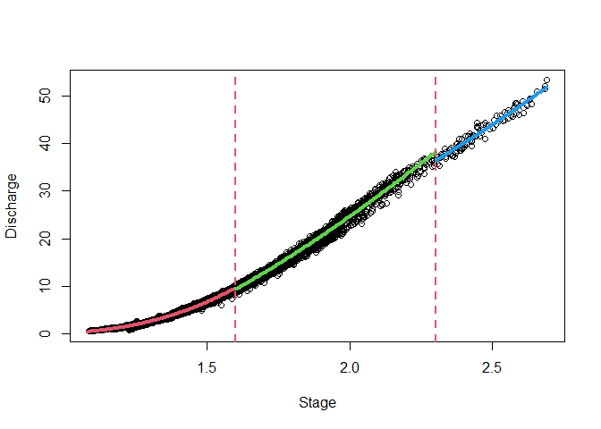
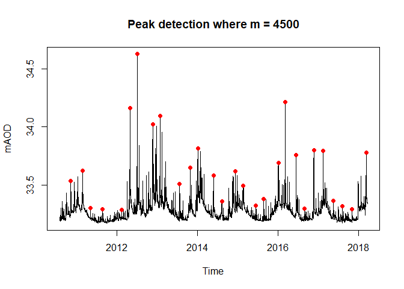
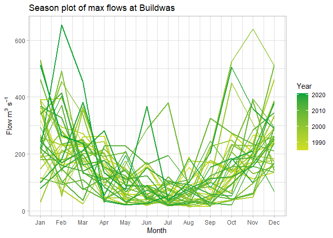

<!-- README.md is generated from README.Rmd. Please edit that file -->

# HydroEnR 

<!-- badges: start -->

[](https://lifecycle.r-lib.org/articles/stages.html#stable)
[](https://github.com/JonPayneEA/HydroEnR/commits/main)
[](https://cran.r-project.org/web/licenses/GNU%20General%20Public%20License)
[](https://github.com/JonPayneEA/HydroEnR)
<!-- badges: end -->

# Welcome to HydroEnR\!

This package is designed for members of Evidence and Risk who are
developing PDM models, applications can be extended into hydrological
analyses. It enables;

  - Easy loading of data downloaded from WISKI
      - Carry out quality checks on these data  
      - Preserve metadata
      - Interactive visualisations
  - Aggregation of data by different periods and through various
    functions using rapid C++ based processes
  - Rain gauge weighting
      - Weighted average method
  - Peak detection in hydrological data
      - Various functions available
  - Conversion of flow and precipitation data to a volumetric measure
    over a designated time step
  - Derivation of Thiessen/Voronoi polygons for use in our realtime
    flood forecast models
  - Download up-to-date meta data on EA gauges published on API
  - Carry out single site analyses
  - Determine baseflow from 15 minute resolution data
  - Review model performance using a greater range of objective
    functions than what is currently available
  - ARMA parameter inspection for stability in a real time forecasting
    context
      - Loads a local version of the shiny application

# Future Updates

  - Basic hydraulic equations such as the Mannings’ equation
      - Import cross sectional data and carry out rudimentary analyses
  - Importing recent flow, stage and rain gauge data via the EAs API
  - Impute missing data into PE series
  - Trend detection in hydrological data
  - ESS in the near future

## Installation

You can install the development version of HydroEnR from
[GitHub](https://github.com/) with:

``` r
# install.packages("devtools")
devtools::install_github("JonPayne88/HydroEnR")
```

## Example 1 - fitting rating curves

This is a basic example which shows you how to fit a rating curve to
observed data.

``` r
library(HydroEnR)
## basic example code
```

``` r
library(data.table)
#> Warning: package 'data.table' was built under R version 4.0.5
library(sf)
#> Warning: package 'sf' was built under R version 4.0.5
#> Linking to GEOS 3.9.1, GDAL 3.2.1, PROJ 7.2.1; sf_use_s2() is TRUE
library(leaflet)
#> Warning: package 'leaflet' was built under R version 4.0.5
library(htmltools)
library(dygraphs)
#> Warning: package 'dygraphs' was built under R version 4.0.5
```

``` r
# Plot raw rating data

plot(Discharge ~ Stage)
```



``` r
# Optimise rating with a control points at 1.6m and 2.3m
rateOptim <- rateOptimise(Discharge, Stage, control = c(1.6, 2.3))
rateOptim
#> $Meta
#>      Limb lowerRange upperRange minStage maxStage minDischarge maxDischarge
#>    <fctr>      <num>      <num>    <num>    <num>        <num>        <num>
#> 1:      1       1.08       1.60    1.085    1.600        0.547         10.2
#> 2:      2       1.60       2.30    1.601    2.296        8.390         37.3
#> 3:      3       2.30       2.69    2.307    2.689       35.300         53.2
#> 
#> $Data
#>        Discharge Stage   Limb      Range lowerRange upperRange
#>            <num> <num> <fctr>     <fctr>      <num>      <num>
#>     1:     0.547 1.103      1 [1.08,1.6]       1.08       1.60
#>     2:     0.579 1.085      1 [1.08,1.6]       1.08       1.60
#>     3:     0.589 1.088      1 [1.08,1.6]       1.08       1.60
#>     4:     0.589 1.089      1 [1.08,1.6]       1.08       1.60
#>     5:     0.593 1.089      1 [1.08,1.6]       1.08       1.60
#>    ---                                                        
#> 18826:    49.300 2.629      3 (2.3,2.69]       2.30       2.69
#> 18827:    50.800 2.655      3 (2.3,2.69]       2.30       2.69
#> 18828:    51.400 2.685      3 (2.3,2.69]       2.30       2.69
#> 18829:    52.000 2.685      3 (2.3,2.69]       2.30       2.69
#> 18830:    53.200 2.689      3 (2.3,2.69]       2.30       2.69
#> 
#> $`NLS Limb 1`
#> Nonlinear regression model
#>   model: Discharge ~ C * (Stage + a)^n
#>    data: dtl
#>       C       a       n 
#> 20.2738 -0.8566  2.5019 
#>  residual sum-of-squares: 873.9
#> 
#> Number of iterations to convergence: 27 
#> Achieved convergence tolerance: 1.49e-08
#> 
#> $`NLS Limb 2`
#> Nonlinear regression model
#>   model: Discharge ~ C * (Stage + a)^n
#>    data: dtl
#>      C      a      n 
#> 34.597 -1.224  1.332 
#>  residual sum-of-squares: 1705
#> 
#> Number of iterations to convergence: 38 
#> Achieved convergence tolerance: 1.49e-08
#> 
#> $`NLS Limb 3`
#> Nonlinear regression model
#>   model: Discharge ~ C * (Stage + a)^n
#>    data: dtl
#>       C       a       n 
#>  8.6308 -0.2623  2.0195 
#>  residual sum-of-squares: 85.17
#> 
#> Number of iterations till stop: 93 
#> Achieved convergence tolerance: 1.49e-08
#> Reason stopped: Number of calls to `fcn' has reached or exceeded `maxfev' == 400.
```

``` r
# Plot the fittings
ratingPlot(rateOptim, colours = c(2, 3, 4))
```



# Example 2 - Peak detection

``` r
peakscpp <- findPeaksCPP(allington$mAoD, m = 4500) # C++
results <- data.table(Position = peakscpp, allington[peakscpp,])  
# Returns the rows where the peaks are found
results
#>     Position          Time_stamp Value   mAoD
#>        <num>              <POSc> <num>  <num>
#>  1:   266986 2018-03-13 02:15:00 0.626 33.776
#>  2:   254644 2017-11-04 12:45:00 0.143 33.293
#>  3:   246204 2017-08-08 14:45:00 0.168 33.318
#>  4:   246200 2017-08-08 13:45:00 0.168 33.318
#>  5:   238258 2017-05-17 20:15:00 0.214 33.364
#>  6:   229531 2017-02-15 22:30:00 0.644 33.794
#>  7:   221262 2016-11-21 19:15:00 0.650 33.800
#>  8:   213018 2016-08-27 22:15:00 0.144 33.294
#>  9:   213016 2016-08-27 21:45:00 0.144 33.294
#> 10:   205914 2016-06-14 22:15:00 0.605 33.755
#> 11:   196564 2016-03-09 12:45:00 1.062 34.212
#> 12:   190623 2016-01-07 15:30:00 0.540 33.690
#> 13:   177591 2015-08-24 21:30:00 0.227 33.377
#> 14:   170610 2015-06-13 04:15:00 0.173 33.323
#> 15:   160023 2015-02-22 21:30:00 0.344 33.494
#> 16:   160019 2015-02-22 20:30:00 0.344 33.494
#> 17:   153056 2014-12-12 07:45:00 0.470 33.620
#> 18:   153054 2014-12-12 07:15:00 0.470 33.620
#> 19:   141192 2014-08-10 17:45:00 0.206 33.356
#> 20:   134072 2014-05-28 13:45:00 0.430 33.580
#> 21:   134071 2014-05-28 13:30:00 0.430 33.580
#> 22:   120403 2014-01-06 04:30:00 0.665 33.815
#> 23:   113712 2013-10-28 11:45:00 0.501 33.651
#> 24:   104444 2013-07-23 22:45:00 0.360 33.510
#> 25:    87369 2013-01-27 02:00:00 0.946 34.096
#> 26:    81345 2012-11-25 08:00:00 0.874 34.024
#> 27:    67739 2012-07-06 14:30:00 1.476 34.626
#> 28:    67738 2012-07-06 14:15:00 1.476 34.626
#> 29:    61218 2012-04-29 16:15:00 1.013 34.163
#> 30:    53961 2012-02-14 02:00:00 0.137 33.287
#> 31:    53953 2012-02-14 00:00:00 0.137 33.287
#> 32:    53951 2012-02-13 23:30:00 0.137 33.287
#> 33:    37525 2011-08-26 21:00:00 0.139 33.289
#> 34:    37523 2011-08-26 20:30:00 0.139 33.289
#> 35:    37521 2011-08-26 20:00:00 0.139 33.289
#> 36:    26910 2011-05-08 07:15:00 0.149 33.299
#> 37:    20100 2011-02-26 08:45:00 0.475 33.625
#> 38:    20098 2011-02-26 08:15:00 0.475 33.625
#> 39:    20097 2011-02-26 08:00:00 0.475 33.625
#> 40:     9598 2010-11-08 23:15:00 0.385 33.535
#> 41:     9596 2010-11-08 22:45:00 0.385 33.535
#>     Position          Time_stamp Value   mAoD
```

``` r
# Plot all points
plot(allington$Time_stamp, allington$mAoD, 
     type = 'l', 
     main = paste0('Peak detection where m = 4500'), 
     xlab = 'Time',
     ylab = 'mAOD')
points(results$Time_stamp, results$mAoD, col = 'red', pch = 19)
```



``` r
# Integrate into loops
# Decide window over which to detect peaks
m <- c(1500, 4000, 6500, 8000)
# Include a threshold to filter results
threshold <- 33.75
# Change plot window too enable 4 plots 2x2
par(mfrow = c(2, 2))
# Loop through the m values
for(i in seq_along(m)){
  p <- HydroEnR:::findPeaksCPP(allington$mAoD, m = m[i])
  results <- data.frame(Position = p, allington[p,])
  results_filter <- dplyr::filter(results, mAoD >= threshold)
  plot(allington$Time_stamp,
       allington$mAoD,
       type = 'l',
       main = paste0('m = ', m[i]),
       xlab = 'Time',
       ylab = 'mAOD')
  points(results_filter$Time_stamp, results_filter$mAoD, col = 'red', pch = 19)
  abline(h = threshold, col = 'red', lty = 2)
}
```


# Example 3 - Single site analysis

    #> Importing meta data
    #> Importing precipitation data
    #> Removing blank elements at top
    #> Converting dates and times

``` r
# Monthplot of the Buildwas flow data
monthPlot(buildwas, name = 'Buildwas', polar = FALSE)
```



``` r
# Retrieve the AMAX series
getAMAX(buildwas)
#>      Year  AMAX
#>     <num> <num>
#>  1:  1985   169
#>  2:  1986   319
#>  3:  1987   353
#>  4:  1988   378
#>  5:  1989   230
#>  6:  1990   396
#>  7:  1991   362
#>  8:  1992   291
#>  9:  1993   329
#> 10:  1994   461
#> 11:  1995   391
#> 12:  1996   251
#> 13:  1997   214
#> 14:  1998   390
#> 15:  1999   450
#> 16:  2000   333
#> 17:  2001   639
#> 18:  2002   454
#> 19:  2003   266
#> 20:  2004   491
#> 21:  2005   235
#> 22:  2006   387
#> 23:  2007   529
#> 24:  2008   461
#> 25:  2009   274
#> 26:  2010   394
#> 27:  2011   371
#> 28:  2012   259
#> 29:  2013   368
#> 30:  2014   415
#> 31:  2015   261
#> 32:  2016   404
#> 33:  2017   207
#> 34:  2018   282
#> 35:  2019   381
#> 36:  2020   653
#> 37:  2021   512
#>      Year  AMAX
```

``` r
# QMED plots
# Can be stored in the environment
# Greater adaptability for users
plotQMED(buildwas)
#> [1] Estimated QMED: 371 cumecs
```


``` r
# Retrieve the l-moments
Ls(buildwas)
#>         L1       L2       L3      L4       LCV        LCA      LKUR      LSkew
#> 1 366.4865 63.28078 5.862162 9.22462 0.1726688 0.09263732 0.1457728 0.09263732
#>   QMED
#> 1  371
```

``` r
# Extreme value plot for buildwas
plotExtVal(buildwas)
```


<!-- What is special about using `README.Rmd` instead of just `README.md`? You can include R chunks like so: -->

<!-- ```{r cars} -->

<!-- summary(cars) -->

<!-- ``` -->

<!-- You'll still need to render `README.Rmd` regularly, to keep `README.md` up-to-date. `devtools::build_readme()` is handy for this. You could also use GitHub Actions to re-render `README.Rmd` every time you push. An example workflow can be found here: <https://github.com/r-lib/actions/tree/v1/examples>. -->

<!-- You can also embed plots, for example: -->

<!-- ```{r pressure, echo = FALSE} -->

<!-- plot(pressure) -->

<!-- ``` -->

<!-- In that case, don't forget to commit and push the resulting figure files, so they display on GitHub and CRAN. -->
